## 📭 Contact Me
 

---

## 🧠 Architecture & Patterns
SOLID • Clean Architecture • Ports and Adapters • Domain-Driven Design (DDD) • CQRS • Event-Driven • Microservices • API Gateway

---

## ⚙️ Backend
 

**.NET:** ASP.NET Core • Minimal APIs • Controllers • Filters • SignalR • gRPC • EF Core • Dapper • ADO.NET • BackgroundService/HostedService • Polly • FluentValidation • xUnit

**Python:** FastAPI • Uvicorn • SQLAlchemy • Pydantic • OpenAI SDK • pytest • Ruff

---

## 🤖 AI Engineering
    [![OpenAI](https://img.shields.io/badge/OpenAI-%23412991.svg?style=for-the-badge&logo=data%3Aimage%2Fsvg%2Bxml%3Bbase64%2CPHN2ZyBmaWxsPSIjZmZmIiByb2xlPSJpbWciIHZpZXdCb3g9IjAgMCAyNCAyNCIgeG1sbnM9Imh0dHA6Ly93d3cudzMub3JnLzIwMDAvc3ZnIj48cGF0aCBkPSJNMjIuMjgxOSA5LjgyMTFhNS45ODQ3IDUuOTg0NyAwIDAgMC0uNTE1Ny00LjkxMDggNi4wNDYyIDYuMDQ2MiAwIDAgMC02LjUwOTgtMi45QTYuMDY1MSA2LjA2NTEgMCAwIDAgNC45ODA3IDQuMTgxOGE1Ljk4NDcgNS45ODQ3IDAgMCAwLTMuOTk3NyAyLjkgNi4wNDYyIDYuMDQ2MiAwIDAgMCAuNzQyNyA3LjA5NjYgNS45OCA1Ljk4IDAgMCAwIC41MTEgNC45MTA3IDYuMDUxIDYuMDUxIDAgMCAwIDYuNTE0NiAyLjkwMDFBNS45ODQ3IDUuOTg0NyAwIDAgMCAxMy4yNTk5IDI0YTYuMDU1NyA2LjA1NTcgMCAwIDAgNS43NzE4LTQuMjA1OCA1Ljk4OTQgNS45ODk0IDAgMCAwIDMuOTk3Ny0yLjkwMDEgNi4wNTU3IDYuMDU1NyAwIDAgMC0uNzQ3NS03LjA3Mjl6bS05LjAyMiAxMi42MDgxYTQuNDc1NSA0LjQ3NTUgMCAwIDEtMi44NzY0LTEuMDQwOGwuMTQxOS0uMDgwNCA0Ljc3ODMtMi43NTgyYS43OTQ4Ljc5NDggMCAwIDAgLjM5MjctLjY4MTN2LTYuNzM2OWwyLjAyIDEuMTY4NmEuMDcxLjA3MSAwIDAgMSAuMDM4LjA1MnY1LjU4MjZhNC41MDQgNC41MDQgMCAwIDEtNC40OTQ1IDQuNDk0NHptLTkuNjYwNy00LjEyNTRhNC40NzA4IDQuNDcwOCAwIDAgMS0uNTM0Ni0zLjAxMzdsLjE0Mi4wODUyIDQuNzgzIDIuNzU4MmEuNzcxMi43NzEyIDAgMCAwIC43ODA2IDBsNS44NDI4LTMuMzY4NXYyLjMzMjRhLjA4MDQuMDgwNCAwIDAgMS0uMDMzMi4wNjE1TDkuNzQgMTkuOTUwMmE0LjQ5OTIgNC40OTkyIDAgMCAxLTYuMTQwOC0xLjY0NjR6TTIuMzQwOCA3Ljg5NTZhNC40ODUgNC40ODUgMCAwIDEgMi4zNjU1LTEuOTcyOFYxMS42YS43NjY0Ljc2NjQgMCAwIDAgLjM4NzkuNjc2NWw1LjgxNDQgMy4zNTQzLTIuMDIwMSAxLjE2ODVhLjA3NTcuMDc1NyAwIDAgMS0uMDcxIDBsLTQuODMwMy0yLjc4NjVBNC41MDQgNC41MDQgMCAwIDEgMi4zNDA4IDcuODcyem0xNi41OTYzIDMuODU1OEwxMy4xMDM4IDguMzY0IDE1LjExOTIgNy4yYS4wNzU3LjA3NTcgMCAwIDEgLjA3MSAwbDQuODMwMyAyLjc5MTNhNC40OTQ0IDQuNDk0NCAwIDAgMS0uNjc2NSA4LjEwNDJ2LTUuNjc3MmEuNzkuNzkgMCAwIDAtLjQwNy0uNjY3em0yLjAxMDctMy4wMjMxbC0uMTQyLS4wODUyLTQuNzczNS0yLjc4MThhLjc3NTkuNzc1OSAwIDAgMC0uNzg1NCAwTDkuNDA5IDkuMjI5N1Y2Ljg5NzRhLjA2NjIuMDY2MiAwIDAgMSAuMDI4NC0uMDYxNWw0LjgzMDMtMi43ODY2YTQuNDk5MiA0LjQ5OTIgMCAwIDEgNi42ODAyIDQuNjZ6TTguMzA2NSAxMi44NjNsLTIuMDItMS4xNjM4YS4wODA0LjA4MDQgMCAwIDEtLjAzOC0uMDU2N1Y2LjA3NDJhNC40OTkyIDQuNDk5MiAwIDAgMSA3LjM3NTctMy40NTM3bC0uMTQyLjA4MDVMOC43MDQgNS40NTlhLjc5NDguNzk0OCAwIDAgMC0uMzkyNy42ODEzem0xLjA5NzYtMi4zNjU0bDIuNjAyLTEuNDk5OCAyLjYwNjkgMS40OTk4djIuOTk5NGwtMi41OTc0IDEuNDk5Ny0yLjYwNjctMS40OTk3WiIvPjwvc3ZnPg%3D%3D&logoColor=white)](https://platform.openai.com/docs/)  

**RAG:** chunking • embeddings • busca vetorial • pgvector (PostgreSQL) • re-ranking • citação de fontes

**Agentes:** LangGraph (grafos de estado, checkpoint, human-in-the-loop) • tool calling • LangChain

**MCP:** servidores em FastMCP (tools, resources, prompts) • integração com clientes MCP

**Serving:** FastAPI • streaming (SSE) • Pydantic para I/O tipada • avaliação e tracing com LangSmith

---

## 🔒 Authentication & Security
OAuth2 • OpenID Connect • JWT • Argon2id • Secrets Management (Docker Secrets / AWS Secrets Manager / Azure Key Vault)

---

## 🧩 Messaging & Processing
 

Kafka • RabbitMQ • Event-Driven

---

## 💾 Databases & Persistence
 [![SQL Server](https://img.shields.io/badge/SQL%20Server-%23CC2927.svg?style=for-the-badge&logo=data%3Aimage%2Fsvg%2Bxml%3Bbase64%2CPHN2ZyBmaWxsPSIjZmZmIiB4bWxucz0iaHR0cDovL3d3dy53My5vcmcvMjAwMC9zdmciIHZpZXdCb3g9IjAgMCAyNCAyNCI%2BPHBhdGggZD0iTTQuNyAyLjV2LjNsLjQuNEw2LjkgNWE2IDYgMCAwIDEgLjcgNiAxNyAxNyAwIDAgMS00LjggNS42bC40LS4xIDEuMy0uOHEyLjUtMS40IDYtMi43YTc1IDc1IDAgMCAxIDEyLjEtMy4zaC40bC0uOC0xLjFhOSA5IDAgMCAwLTIuNi0yLjJRMTcuNSA1LjIgMTQgNC42bC0yLjItLjQtNC0uNy0xLjQtLjItMS0uM3EtLjQgMC0uNy0uNW0xIDEgMS40LjMuNiAydi0uMWE4IDggMCAwIDAtMi0yLjF6bTEuOC40IDIuNy42aC0uMWwtLjguNS0xIC44LS4yLjJ2LS4xTDcuNSA0em0zLjEuNi4xLjQuMiAyaC0uMkw5IDYuNGwtLjUtLjIuNi0uNnptLjIgMCAzLjIuOEwxMS4zIDd2LS4zcTAtMS0uNC0ybTQgLjgtLjIuNXEtLjIuOC0uOSAybC0uMS4zaC0uM0wxMiA3LjJsLS4zLS4xem0uMiAwIDMuNSAxLjIuMy4yaC0uMmwtNC40IDEuNHYtLjJhOCA4IDAgMCAwIC44LTIuNk04LjQgN2wuOC4xIDEuMy41LS4yLjJMOC44IDlsLS4zLjN6TTE5IDdsLS40LjZMMTcuNCA5bC0xIDEuMi0uMy4zdi0uMWwtMS41LTEuNi0uMy0uMnYtLjFsMS0uNSAyLjgtMXptLjMgMCAuMi4xTDIxLjkgOWwuNy43aC0uNHEtMi40LjItNS4zLjloLS4zbC4zLS4zQTkgOSAwIDAgMCAxOS4zIDdtLTguMS45IDEuNy44LS40LjItMiAxem0tLjUgMC0uMi44LS44IDEuOHYuMWwtLjMtLjItLjctLjVoLS4xem0zIDEuMnYuMmwyIDEuNS0uMi4xLTQuNSAxLjVoLS4zbC4zLS4zYTE2IDE2IDAgMCAwIDIuNS0yLjh6bS0uOC4yLTIuMyAzLS4zLjN2LS4xcTAtLjgtLjMtMS4zbC0uMS0uMnptLTQuNiAxLjIuOC41LS4yLjItMS41IDF6bTEuMiAxcS40LjUuNCAxdi4xbC0uNS4yTDYuNiAxNGExNSAxNSAwIDAgMCAyLjktMi43bS0uNiAwLS43LjhhMTIgMTIgMCAwIDEtMi40IDJsLjQtLjQuNi0uOC4zLS4zek0xMCAwYTI0IDI0IDAgMCAwLTQuNyAybC0uNS42LjUuNSAxLjEuNCAyLjguNSAzLjEuNXYtLjJsLS40LS4xdi0uMWwtMS4yLTIuNEwxMCAuM3ptMCAuMnYuMnEwIC44LjQgMS41di40TDcgMS43aC0uNEExNiAxNiAwIDAgMSAxMCAuMk02LjQgMS44bDQgLjgtLjIuMS0xLjcgMWgtLjRMOCAzLjIgNi41IDJ6bS0uMi4xLjUuNy44LjktMS4yLS4yLS44LS4zaC0uMnEwLS41LjktMXptNC40Ljl2LjFsLjcgMS4yaC0uNWwtMS42LS4zIDEuMi0uOHptNC4zIDguNEwxMCAxMi44bC00LjIgMS44LTEuMi4zLTIgMS43LS45IDEtLjcgMS4xYTIgMiAwIDAgMCAuMyAxLjhxLjggMS4yIDIuNiAybDIuNC44YTMxIDMxIDAgMCAwIDUuNS43bC41LS45cTEuMi0yLjUgMS43LTQuNWEyMSAyMSAwIDAgMCAuNC01bC0uMS0xLjh2LS4xbC42LS4yem0tMS4xLjcuMiAyLTEtLjYtMS4yLS44aC4yem0tMi41LjguMy4xIDIuMiAxLjNxLjMgMC0uMS4ybC0yLjUgMS4zLS4zLjJ2LS4ybC40LTIuNnptLS41LjFWMTRsLS40IDEuOC0uNy0uNi0uNy0xLS4yLS41em0tMi4zIDEgLjYgMS4xIDEgMS0uNS4zLTIuMy44LS42LjJWMTd6bS0uOC4zLS4zLjdMNiAxN2wtLjIuMy0uMy0xdi0xbC4xLS4zem02LjMuMnYuMmwtLjMgMy0xLjktLjgtLjgtLjUuMy0uMnptLTkgMS4xdi42cS0uMS43LjIgMS40bC4yLjMtMy4yIDFoLS40cTAtLjggMS0xLjhsMS4yLTF6bTUuNiAxIC4yLjFxMS40LjggMi44IDEuMWguMWwtLjEuMWMtLjUuMy0yIDEtMy43IDEuNWwtLjUuMnYtLjJ6bS0uNS4ydi4ybC0xLjQgMi41LS4yLjUtLjItLjJRNyAxOSA2LjMgMThsLjMtLjIgMy4yLTF6bTMuNiAxLjMtLjggMi44LS4yLjUtMy0uOS0uNi0uMi41LS4zem0tOC4zLjMtMS4xIDEuNS0uNi45LS4zLjQtLjIuM1YyMWwtLjYtLjctLjYtMS4xVjE5bDEuOS0uNSAxLjMtLjN6bS40LjEuMi4yIDEuNyAxLjRoLjJsLTQuNCAxLjZoLS4xdi0uMkw1LjMgMTl6bTMgMi4xLjMuMWExMiAxMiAwIDAgMCAzLjQuOGguMWwtMSAuM0w3IDIzbC4xLS4zIDEuNS0yem0tLjcgMC0uNyAxLjItLjUuNy0uMi40LS4xLjItMi4yLS45LS43LS40IDEuMS0uM3ptNC41IDEtLjkgMi40LTEuNC0uMi0yLjgtLjUuNS0uMSAyLjItLjYgMi4yLS44eiIvPjwvc3ZnPg%3D%3D&logoColor=white)](https://learn.microsoft.com/sql/)   

PostgreSQL • SQL Server (Stored Procedures) • Redis (Cache / PubSub / Streams) • MongoDB • Cassandra

---

## 🌐 Frontend
       

Next.js • NextAuth • React • TypeScript • Vite • TanStack • TailwindCSS • Prisma • ShadCN • API Routes • SSR / SSG

---

## ☁️ DevOps & Cloud
   [![AWS](https://img.shields.io/badge/AWS-%23FF9900.svg?style=for-the-badge&logo=data%3Aimage%2Fsvg%2Bxml%3Bbase64%2CPHN2ZyBmaWxsPSIjZmZmIiB4bWxucz0iaHR0cDovL3d3dy53My5vcmcvMjAwMC9zdmciIHZpZXdCb3g9IjAgMCAyNCAyNCI%2BPHBhdGggZD0iTTYuOCAxMHYuN2wuMy42di40bC0uNi40aC0uNGwtLjMtLjQtLjMtLjVhMyAzIDAgMCAxLTIuMyAxcS0xIDAtMS42LS41YTIgMiAwIDAgMS0uNi0xLjVxMC0xIC43LTEuNy44LS42IDItLjZsMS43LjN2LS42cTAtLjktLjMtMS4zLS40LS40LTEuMy0uNGwtLjkuMS0uOS4zLS4yLjFoLS4ybC0uMS0uMnYtLjdsLjItLjEgMS0uNEw0IDQuOHExLjQgMCAyIC43LjcuNS43IDJ6bS0zLjMgMS4yaC44bC44LS42LjMtLjVWOWwtLjctLjJINHEtLjkgMC0xLjIuMy0uNC4zLS40IDEgMCAuNS4zLjh0LjguM202LjQgMS0uMy0uMi0uMS0uMy0yLTYuMXYtLjRxMC0uMi4yLS4yaC44bC4zLjEuMi4zIDEuMyA1LjMgMS4yLTUuMy4yLS4zSDEzbC4xLjMgMS4zIDUuNCAxLjQtNS40LjEtLjNIMTdsLjIuMXYuNGwtMiA2LjFxMCAuMy0uMi4zbC0uMy4xaC0xbC0uMS0uNC0xLjMtNS4xLTEuMiA1LjFxMCAuMy0uMi4zbC0uMy4xem0xMC4zLjFBNSA1IDAgMCAxIDE4IDEybC0uMi0uM1YxMWwuMS0uMmguNGE0IDQgMCAwIDAgMS44LjRxLjcgMCAxLjItLjJhMSAxIDAgMCAwIC40LS44bC0uMi0uNS0uOC0uNS0xLjItLjNxLS45LS4zLTEuMy0uOGEyIDIgMCAwIDEtLjQtMS4yTDE4IDZsLjYtLjYuOC0uNCAxLjYtLjFoLjVsLjguMy4yLjIuMS4zVjZxMCAuMi0uMi4yaC0uM2wtMS41LS40LTEgLjJxLS40LjMtLjQuN3QuMi42cS4yLjMuOS40bDEuMS40cS45LjMgMS4yLjguNC41LjQgMXQtLjIgMS0uNi43cS0uMy4zLS45LjV6bTEuNSA0QTE3LjYgMTcuNiAwIDAgMSAuMSAxNC42cS0uMi0uNi4zLS40YTI0IDI0IDAgMCAwIDIxIDEuM2MuNC0uMi43LjMuMy42bTEtMS4zYy0uMi0uNS0yLjEtLjItMy0uMXEtLjQgMCAwLS40YzEuNS0xIDQtLjggNC4yLS40czAgMi44LTEuNSA0cS0uNC4yLS4zLS4xYy4zLS44IDEtMi42LjctMyIvPjwvc3ZnPg%3D%3D&logoColor=white)](https://docs.aws.amazon.com/)  

Docker • Kubernetes • GitHub Actions • CI/CD Pipelines • Cloud Deployments (AWS / Azure / Cloudflare)

---

## 🔍 Observability & Monitoring
   

OpenTelemetry • Grafana • Sentry • LangSmith

---

## 💳 Payment Integrations
  [![Itaú](https://img.shields.io/badge/Ita%C3%BA-%23EC7000.svg?style=for-the-badge&logo=data%3Aimage%2Fsvg%2Bxml%3Bbase64%2CPHN2ZyBmaWxsPSIjZmZmIiB4bWxucz0iaHR0cDovL3d3dy53My5vcmcvMjAwMC9zdmciIHdpZHRoPSI1MDAiIGhlaWdodD0iNTAwIj48cGF0aCBkPSJNMjE5IDExYTEwMDQgMTAwNCAwIDAgMC0xMTggMTBsLTUgMS0yMyA1LTMgMXEtMTQgMy0yNSAxMS0xMCA5LTE1IDIzbC0xIDMtNyAzMC02IDQzdjZsLTIgMTVhMTIwNiAxMjA2IDAgMCAwIDQgMjE5bDEgNiAzIDE5IDEgNSAxMCAzNyAzIDUgMSAyIDEwIDEwIDIgMSAxIDFoMWwxNSA3IDE1IDRhNTAyIDUwMiAwIDAgMCA2NiAxMGw5IDEgNDIgM2gxMDRsMTItMWE1MjggNTI4IDAgMCAwIDg4LTEwbDMyLTcgMy0xIDEzLTYgNi01IDEwLTEyIDItM3YtMmw0LTEwIDktNDggMS02YTQ3OSA0NzkgMCAwIDAgNi02M2wxLTE0YTEyNzkgMTI3OSAwIDAgMC0yLTEyM2wtMS0xMi01LTUwYTUwNyA1MDcgMCAwIDAtMTUtNjRsLTMtMy0xMC0xMXEtMTAtNy0yMy0xMWwtNS0xLTgtMmgtNGwtNTctOS04LTFoLTZsLTgtMWExMjg2IDEyODYgMCAwIDAtMTE1LTJNODYgMjE0bDIgMSA2IDIgNSA3IDEgMSAxIDIgMSA3LTEgN2EyMCAyMCAwIDAgMS0xNyAxM2gtN2wtMS0xaC0zbC0yLTEtMS0xaC0xbC03LTctMS0zdi0xNGwxLTMgMS0xIDUtNiA2LTIgMi0xem0zMjggMjF2MTVoLTU4di0yMGwzLTEgMjItMyA0LTEgNC0xaDRsMy0xIDQtMSAxMS0yaDNabS0yNDkgMTR2MThoMzB2MjZoLTMwdjI4YzAgMzAgMCAyOSAyIDMzcTIgNCA3IDZsMiAxIDE1LTFoMnYyN2wtOSAxYTgzIDgzIDAgMCAxLTI4LTFsLTItMWgtMWwtMi0xLTEtMWgtMmwtNC0zLTItMS00LTVhMzcgMzcgMCAwIDEtNy0xNmwtMS00di0zMWwtMS0zMWgtMTd2LTI2aDE4di0zMWg0bDMtMSA0LTFoNGw0LTEgMi0xaDRsMTAtMnptMTAwIDE1YTU4IDU4IDAgMCAxIDI4IDhsMyAzIDIgMiA3IDggNSAxMyAxIDN2MmwxIDQzdjQwaC0zM3YtMTJsLTEgMS04IDgtMTIgNWE3MSA3MSAwIDAgMS0yOC0xbC0zLTEtMy0yLTMtMS01LTUtNC00di0ybC0yLTMtMS0yLTEtMnYtMmwtMS03LTEtMiAxLTkgMS0ydi0ybDMtNyAxLTEgNC01di0xaDF2LTFhNDggNDggMCAwIDEgMjQtMTJsNC0xaDJsNS0xIDUtMSAyMSAxdi03bC0zLTUtNC00LTEtMS01LTItMS0xYTc4IDc4IDAgMCAwLTQwIDRoLTJsLTIgMS0yIDFoLTJsLTIgMS0xIDF2LTI5aDJsMS0xIDMtMWgybDItMSAyLTFoM2wzLTEgNC0xaDR6TTk4IDMyN3Y1OUg2M1YyNjdoMzVabTI2Ny0yMyAxIDQ1IDUgOCAzIDIgMyAxIDYgMWg0bDItMSAzLTIgNS00IDEtMSAxLTJ2LTFsMS0zIDEtMSAxLTQydi0zN2gzNXYxMTloLTM0di02bC0xLTZ2MWwtOSA4LTQgMi0zIDItMyAxaC0ybC0xMSAxLTE1LTItMi0xaC0xbC0xLTEtMi0xYy0zLTEtOS03LTExLTEwYTQ0IDQ0IDAgMCAxLTctMThsLTEtM3YtNDRsLTEtNDJoMzZabTAgMCIgc3R5bGU9InN0cm9rZTpub25lO2ZpbGwtcnVsZTpub256ZXJvO2ZpbGw6I2ZmZjtmaWxsLW9wYWNpdHk6MSIvPjwvc3ZnPg%3D%3D&logoColor=white)](https://devportal.itau.com.br/) [![Santander](https://img.shields.io/badge/Santander-%23EC0000.svg?style=for-the-badge&logo=data%3Aimage%2Fsvg%2Bxml%3Bbase64%2CPHN2ZyBmaWxsPSIjZmZmIiB4bWxucz0iaHR0cDovL3d3dy53My5vcmcvMjAwMC9zdmciIHdpZHRoPSI4OCIgaGVpZ2h0PSI4MCIgdmlld0JveD0iMCAwIDg4IDgwIj48ZyBzdHlsZT0iZmlsbDojZmZmO2ZpbGwtb3BhY2l0eToxIj48cGF0aCBkPSJNLTEzNy4yNTkgMjg3LjgyM2MtLjI3OCAyLjQ2LS4xNjIgNS4wOTguNTQ2IDcuMjI4Ljk1MyAyLjg2OSAyLjI3IDQuOTM3IDcuMTI0IDExLjI1IDUuMTIxIDYuNjYzIDYuNzYgOS4wNzggNy45NzkgMTIuNTMzLjk5NiAyLjgyNSAxLjAxNyA0LjQ1Ny41OSA3LjAyIDQuNDg2Ljg1NSAxMS44NCAzLjIzOCAxNi43NyA2LjE5NCA0LjU3MiAyLjgxMiA3Ljg5NyA2LjQ1OCA5LjExNCA5Ljk5NS43MiAyLjA5My42OSA1LjMzNi0uMDczIDcuMzY1LS43MzQgMS45NDgtMS43NCAzLjU3NS0zLjIyNSA1LjIwMS01LjkwMiA2LjQ2NS0xNy41ODcgMTEuMTA4LTMxLjY2MiAxMi41ODYtMy4xMTQuMzI3LTEwLjc0NC41Ni0xMy4zNjEuNDA4LTE4LjgwMy0xLjA5NS0zMy45MjMtNy41OS0zOC4yMjYtMTYuNDE5LTEuNzktMy42NzEtMS43NDUtNi44MzIuMTQtMTAuNDYzIDEuNTU2LTIuOTkzIDUuODE4LTYuNjkzIDEwLjgzLTkuNDA4IDQuODIzLTIuMzIxIDkuMzUtNC4wNTYgMTQuMjAyLTUuNDIxLjIzNiAzLjE2OCA2LjQxIDEwLjc0IDguNDUzIDEzLjQyIDQuNDU3IDUuODM0IDYuMjIgOC42MTYgNy40NzkgMTAuODQ0Ljc1NiAxLjMzOCAxLjE4MyAyLjE5My45NyA0Ljc0IDAgMCAxLjcxNS0xLjU1MiAyLjM2MS0yLjg3LjgzOC0xLjcwNyAxLjEzNi0zLjQzOC45NzUtNS42NjMtLjE5NC0yLjY4LS42NDktNC4zMjEtMS45My02Ljk0NC0xLjI0NC0yLjU1LTMuMDMtNS4xMy02LjQyMy05LjI5NC00Ljc5MS01Ljg4LTYuNTY1LTkuMTExLTcuMjk3LTEzLjMwNy0uODEzLTQuNjU3LjQ5Ni05LjYwNyAzLjE3OC0xMi4wMTkuNTgzLS41MjQgMS41MjItMS4wMzUgMS41MjItMS4wMzVzLS4wOCAxLjItLjA4IDIuNTY0YzAgMi44ODUuMzI5IDQuMzg3IDEuNDM2IDYuNTg0IDEuMzc0IDIuNzI4IDMuMjc1IDUuMjggOS4xMDcgMTIuMjE5IDUuMTYgNi4xNDEgNi43NjQgOS4yNjEgNi43NjQgMTMuMTZsLjAwMiAxLjg4czEuMzYzLTEuMDQgMS45OTQtMS45OTRjMi0zLjAyIDIuMzE4LTcuNzMxLjc5NS0xMS45MDUtMS4wNDQtMi44Ni0yLjczNi01LjQ2NC03LjczOS0xMS43NTEtNS4wOTMtNi40LTcuMjMtMTEuNTI4LTcuMjMtMTUuODAxIDAtNC4yNzQuOTI4LTguMzUgNC45MTUtMTAuODk3IiBzdHlsZT0iZmlsbDojZmZmO2ZpbGwtb3BhY2l0eToxO2Rpc3BsYXk6aW5saW5lIiB0cmFuc2Zvcm09InRyYW5zbGF0ZSgxODQuNjUyIC0yODAuMTc1KXNjYWxlKC45ODY2MSkiLz48L2c%2BPC9zdmc%2B&logoColor=white)](https://developer.santander.com.br/)

Stripe • Mercado Pago • Itaú • Santander (official certified banking APIs)

---

<picture>
  <source media="(prefers-color-scheme: dark)" srcset="https://raw.githubusercontent.com/MatheusCarvalho12/MatheusCarvalho12/output/github-contribution-grid-snake-dark.svg" />
  
</picture>

